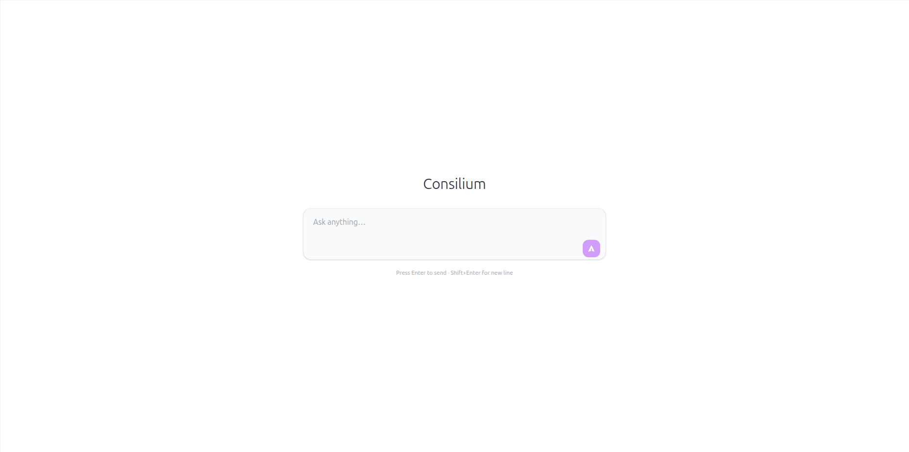
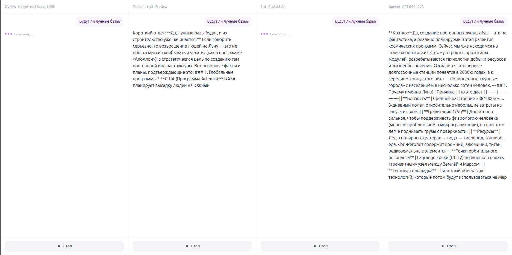
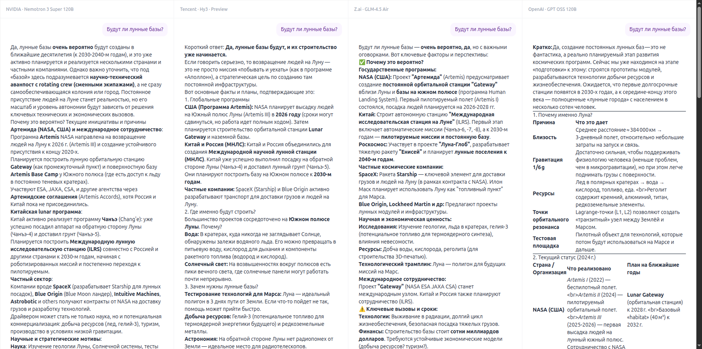

# Consilium

Multi-model AI chat — один промпт, несколько моделей, параллельное сравнение ответов.

## Идея

Пользователь вводит промпт, и он одновременно отправляется нескольким AI-моделям. Каждый ответ стримится в свою колонку в реальном времени — можно сравнивать качество, стиль и скорость генерации side-by-side.

<p align="center">
  
</p>

<p align="center">
  
</p>

<p align="center">
  
</p>

## Архитектура

```
frontend (Vue 3 + Vite)  ──proxy──▶  backend (Laravel + Octane/FrankenPHP)
         │                                      │
    Pinia store                          GenerationService
    SSE (EventSource)                    OpenRouterClient
    Column panels                        SSE streaming
```

- **Backend** — Laravel 12 + Octane (FrankenPHP). Многопоточная обработка запросов для параллельного стриминга нескольких генераций.
- **Frontend** — Vue 3, TypeScript, Pinia, TailwindCSS. SSE-соединения через `EventSource`, по одному на каждую активную генерацию.
- **AI-провайдер** — [OpenRouter](https://openrouter.ai/), единый API к десяткам моделей.

## Ключевые концепции

- **Workspace** — рабочая область с несколькими колонками. Привязан к сессии браузера (без регистрации).
- **Column** — колонка с одной моделью. Содержит историю сообщений и текущую генерацию.
- **Generation** — процесс генерации ответа моделью. Жизненный цикл: `pending → streaming → completed | error | cancelled`.
- **SSE-streaming** — токены доставляются клиенту в реальном времени через Server-Sent Events с heartbeat каждые 15 секунд.

## Модели

| Tier    | Модели                                                     |
| ------- | ---------------------------------------------------------- |
| Premium | xAI Grok, Google Gemini, Z.ai GLM, OpenAI GPT              |
| Free    | NVIDIA Nemotron, Tencent Hy3, Z.ai GLM Air, OpenAI GPT OSS |

Конфигурация моделей: `backend/config/models.php`.

## Запуск

```bash
# Backend
cd backend
cp .env.example .env
composer install
php artisan key:generate
php artisan migrate
php artisan octane:start --port=8000

# Frontend
cd frontend
npm install
npm run dev
```

Frontend проксирует `/api` и `/sanctum` на `localhost:8000` (Octane).

## Тесты

```bash
cd backend
php artisan test   # ~232 тестов
```
